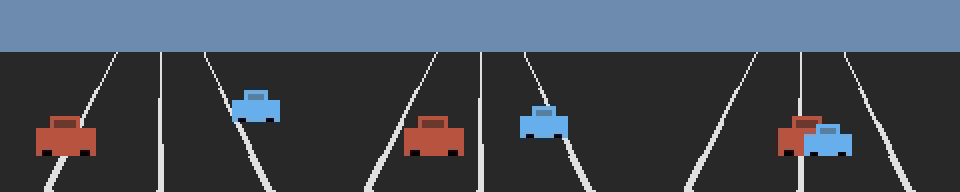
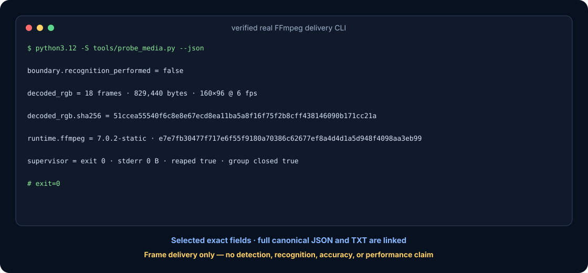
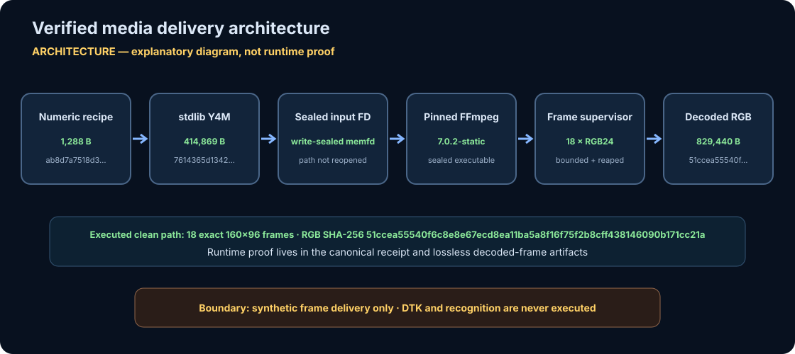
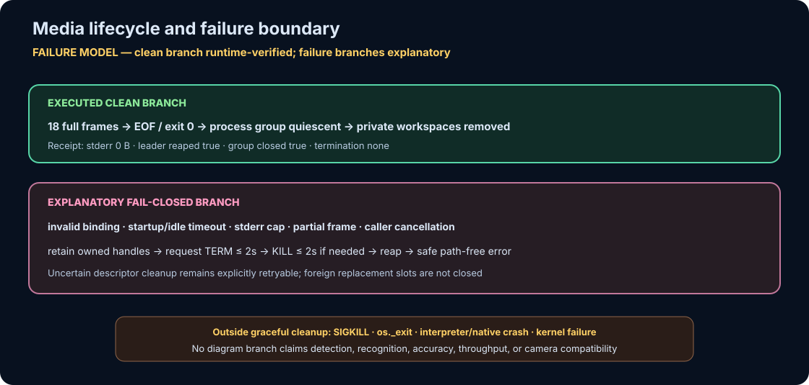

# Termux DTK ALPR Runner

[](https://github.com/omar07ibrahim/termux-dtk-alpr-runner/actions/workflows/ci.yml) [](https://github.com/omar07ibrahim/termux-dtk-alpr-runner/blob/main/.github/workflows/ci.yml)

This repository is an experimental edge-vision integration for running the
proprietary DTK **Linux ARM64** SDK inside a Termux-managed Ubuntu environment.
The SDK files and license are deliberately not part of this repository. Place
an official ARM64 SDK distribution in the ignored `vendor/arm64/` directory.

Those files are glibc Linux AArch64 binaries, so the intended phone path is:

```text
Termux -> proot-distro Ubuntu -> Python -> libDTKLPR.so
```

It is not an Android APK and it is not trying to load Linux `.so` files through Android JNI.

> **Current boundary:** the Python orchestration, multi-camera aggregation,
> frame handoff, and software zoom code are present. A complete run additionally
> requires a separately licensed SDK, compatible ARM64 hardware, FFmpeg, and a
> camera source. The repository does not currently publish a reproducible
> end-to-end benchmark or independently verifiable recognition-accuracy result.
> See the [project charter](docs/charter.md) and
> [threat model](docs/threat-model.md).

## Hosted verification

The pinned [CI workflow](.github/workflows/ci.yml) runs on Ubuntu 24.04 with exact CPython 3.12.3. It compiles the Python surfaces, installs only the hash-locked evidence FFmpeg runtime, runs all 276 vendor-independent tests, reconstructs the complete 15-file visual/evidence inventory, and rejects tracked or unignored drift. It never installs or executes DTK, opens a camera, or uses real plate data.

## What It Does

- Runs DTK LPR inside Ubuntu using `libDTKLPR.so`.
- Runs DTK **video mode** using `libDTKVID.so` for RTSP/IP-camera streams.
- Uses `ffmpeg` as the default RTSP decoder and feeds DTK video frames through `VideoFrame_CreateFromImageBuffer`.
- Runs **multi-camera mode** with one DTK video engine per stream.
- Deduplicates the same plate text across all cameras and increments `count` instead of creating spam events.
- Selects the best visible target.
- Performs software zoom/crop around that target.
- Provides `- / Auto / +` zoom controls in the dashboard.
- Writes `latest.jpg`, `latest_zoom.jpg`, `status.json`, and `zoom_command.json`.
- Serves a small local dashboard at `http://127.0.0.1:8765/`.

The intended continuous-stream path is video mode, not
`termux-camera-photo`, because Termux:API exposes individual photo captures
rather than a continuous frame stream. No throughput comparison or
"maximum-performance" result is published yet.

The current zoom is software zoom. Termux/proot does not expose Camera2 hardware zoom controls. The emitted `zoom_command.json` is designed so a later motor/PTZ controller can consume the target center and pan/tilt error.

## Reproducible vendor-independent evidence

The repository publishes two deliberately separate evidence lanes. The media
lane proves exact synthetic-frame delivery through a real, hash-pinned FFmpeg
process. The event lane proves deterministic orchestration, aggregation, and
zoom geometry without media. Neither lane executes DTK or performs detection or
recognition.

### Verified FFmpeg RGB delivery — no recognition

The [verified media boundary](docs/media-evidence.md) renders a numeric-only
geometric recipe, binds the exact Y4M bytes and pinned FFmpeg executable to
write-sealed descriptors, and delivers RGB24 through the production
`FfmpegFrameSource` supervisor. One probe performs two real supervised runs and
requires byte-identical frames and lifecycle receipts.



The contact sheet contains decoded frames `0`, `8`, and `17` at nearest-neighbor
`2×` scale. It has no labels, overlays, EXIF, or timestamps; every output pixel
is an exact replication of a decoded source pixel bound to the receipt.


The GIF contains all `18` complete `160×96` frames in receipt order, uses the
exact 34 decoded colors as its active palette without quantization (plus the
required zero padding), and loops the three-second sequence. The static contact
sheet above is the motion-safe alternative.



The complete public output is committed as
[canonical JSON](docs/visuals/generated/media-receipt.json) and an
[exact normalized CLI transcript](docs/visuals/generated/media-cli-receipt.txt).
The rendered terminal is explicitly a selected-field view, not a literal
screen capture.





The architecture and failure figures explain the verified byte path and
supervision contract. They are labeled diagrams; runtime proof remains in the
receipt, decoded pixels, tests, and reproducible renderer.

The descriptor handoff is also fail-closed: command arguments snapshot a
borrowed FD's file identity, status flags, and current offset without opening a
hidden long-lived duplicate. At lazy start the supervisor revalidates every FD,
atomically duplicates each into a pre-owned private descriptor slot, and closes
its parent-side copies immediately after spawn. Missing descriptors and
replacements with a different observable signature are rejected before FFmpeg
can consume them; callers must retain the original FD unchanged until start.

| Exact media fact | Verified value |
|---|---|
| Source | `18` synthetic frames, `160×96`, `6 fps`, RGB24 |
| Decoded bytes | `829,440` |
| Decoded RGB SHA-256 | `51ccea55540f6c8e8e67ecd8ea11ba5a8f16f75f2b8cff438146090b171cc21a` |
| Pinned FFmpeg SHA-256 | `e7e7fb30477f717e6f55f9180a70386c62677ef8a4d4d1a5d948f4098aa3eb99` |
| Clean lifecycle | exit `0`, stderr `0 B`, leader reaped, process group closed |
| Explicit non-claims | no camera, DTK, detection, recognition, accuracy, latency, throughput, or hardware result |

### Reproduce and verify both lanes

Install the hash-locked evidence runtime into the ignored repository-local
directory. This does not modify global AWS packages or install the proprietary
SDK:

```bash
python3.12 -m pip install \
  --disable-pip-version-check \
  --no-deps \
  --require-hashes \
  --only-binary=:all: \
  --target .t/media-evidence-runtime \
  -r requirements-media-evidence.lock
```

Run the public media receipt:

```bash
python3.12 -S tools/probe_media.py --json
```

The event lane needs only CPython 3.12 and the standard library:

```bash
mkdir -p .t/manual-synthetic
python3.12 -S -m alpr_runner.synthetic \
  --trace examples/synthetic-events-v1.json \
  --out .t/manual-synthetic
```

Verify every committed artifact:

```bash
python3.12 -S tools/render_readme_visuals.py --check
```

The verifier runs each public CLI twice, separately captures the real decoded
frames, requires the frame-bound and CLI receipts to match, recomputes raster
pixels, checks source hashes, privacy boundaries, binary structure, SVG
accessibility, and the exact generated-file inventory. On Linux it also
fail-closes unsafe `SIGCHLD`/thread/child contexts, contains descendants under a
temporary subreaper, and turns parent `SIGHUP`/`SIGINT`/`SIGQUIT`/`SIGTERM` into
ordered cleanup; those termination signals must be initially unblocked.
Maintainers rebuild with `--write`; publication stages every allowlisted file
and replaces the manifest last. CI runs the same `--check` contract.


### Synthetic event orchestration — no media

Five validated `SYNTH-*` events exercise the production plate-to-target
geometry, per-camera zoom controller, and cross-camera aggregation registry.
This lane needs no camera, image, FFmpeg, DTK binary, license, network access,
or third-party package. It does not exercise or imitate ALPR recognition.


The next figure is intentionally labeled as an explanatory architecture
diagram, not runtime proof.


| Evidence | Derivation | What it verifies | Explicitly not verified |
|---|---|---|---|
| [Media receipt](docs/visuals/generated/media-receipt.json), [CLI transcript](docs/visuals/generated/media-cli-receipt.txt), and [terminal view](docs/visuals/generated/media-cli-receipt.svg) | Two byte-identical public CLI runs matched to a separately captured frame-bound receipt | Pinned identities, exact RGB delivery, clean supervisor lifecycle, public non-recognition boundary | A literal screen capture, camera/SDK behavior, recognition, accuracy, or performance |
| [Contact sheet](docs/visuals/generated/decoded-contact-sheet.png) and [lossless GIF](docs/visuals/generated/decoded-rgb.gif) | Encoded directly from actual pinned-FFmpeg RGB output and decoded again by the verifier | Pixel identity, frame order, palette preservation, three-second motion sequence | Detection quality, real-scene authenticity, production video compatibility |
| [Media architecture](docs/visuals/generated/media-architecture.svg) / [failure boundary](docs/visuals/generated/media-failure-boundary.svg) | Explanatory diagrams populated with verified receipt values | Byte-flow, trust boundary, clean path, documented cleanup model | Independent runtime proof for drawn failure branches |
| [CLI transcript](docs/visuals/generated/terminal-transcript.txt) and [terminal evidence](docs/visuals/generated/terminal-evidence.svg) | Exact stdout from two byte-identical runs, framed by a renderer-added path-normalized command and `exit=0` marker | Public command shape, five-event/two-camera execution, explicit non-recognition boundary | A literal screen capture, ALPR accuracy, camera compatibility, SDK execution |
| [Synthetic result](docs/visuals/generated/synthetic-result.json) | Actual private-mode CLI artifact | Canonical fixture ingestion, aggregation counts, target and zoom data | Exhaustive validation, image processing, detection quality, latency or throughput |
| [Event flow](docs/visuals/generated/event-flow.svg) | Drawn from the result's five events | Cross-camera deduplication and aggregate state | Production traffic or real plates |
| [Zoom geometry](docs/visuals/generated/zoom-geometry.svg) | Drawn from final normalized target/crop coordinates | Geometry and bounded per-camera zoom state | Pixel crop quality, optical zoom, PTZ control |
| [Architecture](docs/visuals/generated/architecture-boundary.svg) | Explanatory diagram for the synthetic-event lane | Trust boundary between orchestration and external recognition | Runtime behavior |
| [Workflow](docs/visuals/generated/setup-workflow.svg) | Explanatory setup shared by both evidence lanes | Reproduction and verification steps | Runtime behavior |
| [SHA-256 manifest](docs/visuals/generated/manifest.sha256.json) | Two-lane renderer inventory and source snapshot | Exact inputs, outputs, lane memberships/evidence labels, byte currency | Artifact signing or third-party attestation |

## Phone Install

On Android:

1. Install Termux from F-Droid.
2. Install Termux:API from F-Droid.
3. Put the ARM64 DTK package in one of these places:

```text
/sdcard/Download/arm64/
/sdcard/Download/arm64.zip
/sdcard/Download/Telegram/arm64/
/sdcard/Download/Telegram/arm64.zip
```

4. Copy this `termux-dtk-alpr` folder to the phone, then run in Termux:

```bash
cd ~/termux-dtk-alpr
bash termux/install.sh
```

5. Start the continuous-stream runner from a real camera stream:

```bash
bash ~/dtk-alpr/app/termux/run_camera_stream.sh
```

The Android APK starts a local H.264 RTSP camera stream at:

```text
rtsp://127.0.0.1:8554/live
```

Termux reads that local stream with `ffmpeg` and feeds raw frames to DTK video
mode, keeping RTSP decoding in FFmpeg while still using DTK's video engine.

For three cameras, expose three RTSP/H.264 streams and run:

```bash
bash ~/dtk-alpr/app/termux/run_multi_camera_streams.sh \
  rtsp://camera1/live \
  rtsp://camera2/live \
  rtsp://camera3/live
```

That starts three independent DTK engines: `cam1`, `cam2`, and `cam3`.
The shared plate table is written to:

```text
~/dtk-alpr/app/runtime-multi/plate_counts.json
~/dtk-alpr/app/runtime-multi/status.json
```

If the same plate appears again, the runner updates the same entry:

```json
{
  "key": "SYNTH01",
  "text": "SYNTH-01",
  "count": 17,
  "cameras": {
    "SYNTH-CAM-01": 11,
    "SYNTH-CAM-02": 6
  }
}
```

Use a phone camera streamer that can output RTSP/H.264. The following is an
unbenchmarked starting profile for manual compatibility testing, not a measured
performance recommendation:

```text
1280x720
15-25 FPS
H.264
fixed focus / continuous video focus
disable beauty/HDR/stabilization if latency matters
```

For three cameras, the current scripts default to
`THREADS_PER_ENGINE=1`. Trying `THREADS_PER_ENGINE=2` and reducing preview
frequency are manual tuning heuristics; the repository does not yet publish
comparative measurements:

```bash
THREADS_PER_ENGINE=1 PREVIEW_EVERY=0 bash ~/dtk-alpr/app/termux/run_multi_camera_streams.sh ...
```

Fallback snapshot mode exists, but it is not the continuous-stream path:

```bash
bash ~/dtk-alpr/app/termux/run_phone.sh
```

Open:

```text
http://127.0.0.1:8765/
```

## Local Still-Image Test In Ubuntu

Inside Ubuntu/proot:

```bash
cd /data/data/com.termux/files/home/dtk-alpr/app
bash ubuntu/run_ubuntu.sh --source file --input /path/to/sample.jpg --once
```

From normal Termux:

```bash
bash ~/dtk-alpr/app/termux/run_photo_test.sh /sdcard/Download/alpr-samples/sample1.jpg
```

## Local Video Test In Ubuntu

```bash
bash ubuntu/run_video.sh --file /path/to/video.mp4 --repeat 1 --preview-every 0
```

## DTK License

If DTK prints error `2`, it usually means the engine has no activated
recognition channel. Check the license from Termux:

```bash
bash ~/dtk-alpr/app/termux/activate_license.sh
```

Online activation:

```bash
bash ~/dtk-alpr/app/termux/activate_license.sh YOUR_LICENSE_KEY
```

Offline activation:

```bash
bash ~/dtk-alpr/app/termux/activate_license.sh getactlink YOUR_LICENSE_KEY
bash ~/dtk-alpr/app/termux/activate_license.sh setactcode YOUR_ACTIVATION_CODE
```

For RTSP camera:

```bash
bash ubuntu/run_video.sh --rtsp rtsp://camera.invalid/stream1 --preview-every 0
```

Do not put camera usernames or passwords directly in a command-line URL. They
can be exposed through shell history, process listings, logs, and runtime
status files. The current runner has no secret-provider integration; use only
credential-free local or otherwise isolated streams until that boundary is
implemented.

For the companion Android APK local stream:

```bash
bash ubuntu/run_ffmpeg_video.sh --rtsp rtsp://127.0.0.1:8554/live --preview-every 20
```

The old DTKVID capture backend is still available for comparison:

```bash
CAPTURE_BACKEND=dtkvid bash ~/dtk-alpr/app/termux/run_camera_stream.sh
```

For three video streams:

```bash
bash ubuntu/run_multi_video.sh \
  --rtsp rtsp://camera1.invalid/stream1 \
  --rtsp rtsp://camera2.invalid/stream1 \
  --rtsp rtsp://camera3.invalid/stream1 \
  --threads 1 \
  --preview-every 0
```

## Privacy and deployment safety

License plates, camera URLs, frames, timestamps, device identifiers, and
vehicle metadata can be sensitive. The current implementation writes raw
runtime JSON and preview images. Runtime directories are tightened to mode
`0700`; preview JPEGs are first encoded into bounded memory and then published
through descriptor-relative atomic replacement at mode `0600`. Symlink and
special-file destinations fail closed, and source paths and RTSP authorities
are excluded from status records.
These controls do not provide retention, encryption, authentication, or plate
redaction. Use only footage you are authorized to process, keep the output
directory private, and do not expose the loopback dashboard through a reverse
proxy or port-forward.

`127.0.0.1` binding limits the default dashboard listener to the local network
namespace; it is not an authentication or authorization mechanism. Review
[`docs/threat-model.md`](docs/threat-model.md) before using any non-synthetic
camera source.

## License

No DTK binaries, models, activation material, or license rights are distributed
here. The runner does not patch or bypass DTK licensing. If
`LPREngine_IsLicensed()` returns an error, the program reports it and stops.
The repository itself does not yet declare an open-source license; treat the
source as all-rights-reserved until an explicit license file is added.
