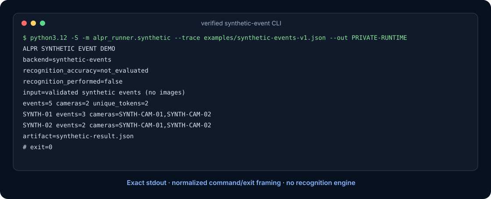
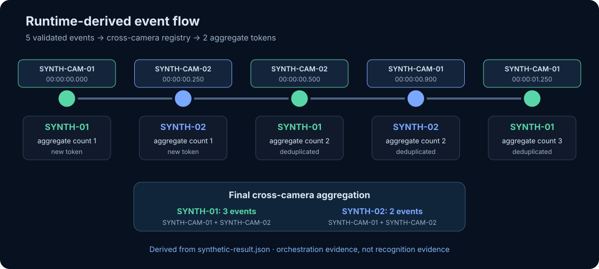
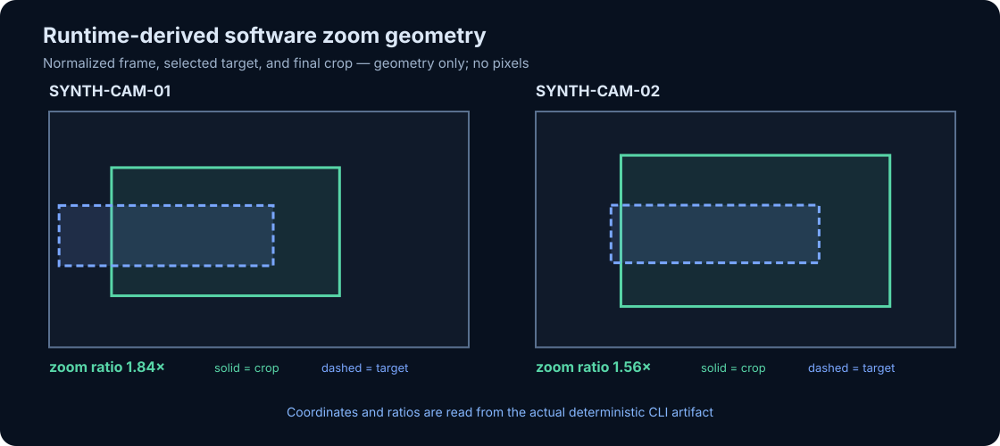
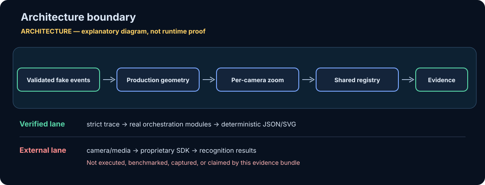
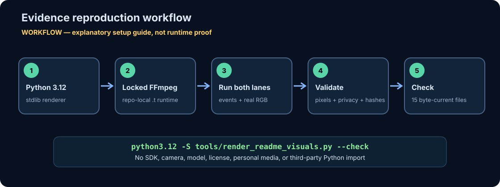

# Termux DTK ALPR Runner

This repository is an experimental edge-vision integration for running the
proprietary DTK **Linux ARM64** SDK inside a Termux-managed Ubuntu environment.
The SDK files and license are deliberately not part of this repository. Place
an official ARM64 SDK distribution in the ignored `vendor/arm64/` directory.

Those files are glibc Linux AArch64 binaries, so the intended phone path is:

```text
Termux -> proot-distro Ubuntu -> Python -> libDTKLPR.so
```

It is not an Android APK and it is not trying to load Linux `.so` files through Android JNI.

> **Current boundary:** the Python orchestration, multi-camera aggregation,
> frame handoff, and software zoom code are present. A complete run additionally
> requires a separately licensed SDK, compatible ARM64 hardware, FFmpeg, and a
> camera source. The repository does not currently publish a reproducible
> end-to-end benchmark or independently verifiable recognition-accuracy result.
> See the [project charter](docs/charter.md) and
> [threat model](docs/threat-model.md).

## What It Does

- Runs DTK LPR inside Ubuntu using `libDTKLPR.so`.
- Runs DTK **video mode** using `libDTKVID.so` for RTSP/IP-camera streams.
- Uses `ffmpeg` as the default RTSP decoder and feeds DTK video frames through `VideoFrame_CreateFromImageBuffer`.
- Runs **multi-camera mode** with one DTK video engine per stream.
- Deduplicates the same plate text across all cameras and increments `count` instead of creating spam events.
- Selects the best visible target.
- Performs software zoom/crop around that target.
- Provides `- / Auto / +` zoom controls in the dashboard.
- Writes `latest.jpg`, `latest_zoom.jpg`, `status.json`, and `zoom_command.json`.
- Serves a small local dashboard at `http://127.0.0.1:8765/`.

The intended continuous-stream path is video mode, not
`termux-camera-photo`, because Termux:API exposes individual photo captures
rather than a continuous frame stream. No throughput comparison or
"maximum-performance" result is published yet.

The current zoom is software zoom. Termux/proot does not expose Camera2 hardware zoom controls. The emitted `zoom_command.json` is designed so a later motor/PTZ controller can consume the target center and pan/tilt error.

## Reproducible vendor-independent evidence

The repository includes one deliberately narrow evidence path that needs no
camera, image, DTK binary, license, network access, or third-party Python
package. Five validated `SYNTH-*` events exercise the production
plate-to-target geometry, per-camera zoom controller, and cross-camera
aggregation registry. They do **not** exercise or imitate ALPR recognition.

The separate [verified media boundary](docs/media-evidence.md) defines a
hash-pinned, repository-local FFmpeg profile for upcoming frame-delivery
evidence. Its canonical
[numeric-only geometric recipe](examples/synthetic-media-v1.json) is already
source-verifiable without FFmpeg. The scope and non-claims are explicit: the
future process probe will not assert DTK execution, recognition quality,
camera compatibility, or performance. Until that evidence is committed and
passes its own verifier, the figures below remain event-level evidence only.

Run the public fixture directly:

```bash
mkdir -p .t/manual-synthetic
python3.12 -S -m alpr_runner.synthetic \
  --trace examples/synthetic-events-v1.json \
  --out .t/manual-synthetic
```

Verify every committed artifact by running the CLI twice in separate private
workspaces, checking byte determinism, source hashes, privacy boundaries, SVG
accessibility, and the exact generated-file inventory:

```bash
python3.12 -S tools/render_readme_visuals.py --check
```

Maintainers rebuild the bundle explicitly with `--write`; publication stages
every file, atomically replaces each allowlisted destination, and replaces the
manifest last. The canonical fixture is byte-tied to
`synthetic.default_trace()`. CLI stdout must exactly match the canonical
summary of the JSON result, while the published transcript adds only a
path-normalized command line and an explicit exit marker. CI runs the same
`--check` contract.







The next two figures explain boundaries and setup. They are intentionally
labeled as architecture/workflow material, not as runtime proof.





| Evidence | Derivation | What it verifies | Explicitly not verified |
|---|---|---|---|
| [CLI transcript](docs/visuals/generated/terminal-transcript.txt) and [terminal evidence](docs/visuals/generated/terminal-evidence.svg) | Exact stdout from two byte-identical runs, framed by a renderer-added path-normalized command and `exit=0` marker | Public command shape, five-event/two-camera execution, explicit non-recognition boundary | A literal screen capture, ALPR accuracy, camera compatibility, SDK execution |
| [Synthetic result](docs/visuals/generated/synthetic-result.json) | Actual private-mode CLI artifact | Canonical fixture ingestion, aggregation counts, target and zoom data | Exhaustive validation, image processing, detection quality, latency or throughput |
| [Event flow](docs/visuals/generated/event-flow.svg) | Drawn from the result's five events | Cross-camera deduplication and aggregate state | Production traffic or real plates |
| [Zoom geometry](docs/visuals/generated/zoom-geometry.svg) | Drawn from final normalized target/crop coordinates | Geometry and bounded per-camera zoom state | Pixel crop quality, optical zoom, PTZ control |
| [Architecture](docs/visuals/generated/architecture-boundary.svg) / [workflow](docs/visuals/generated/setup-workflow.svg) | Explanatory diagrams | Trust boundary and reproduction steps | Runtime behavior |
| [SHA-256 manifest](docs/visuals/generated/manifest.sha256.json) | Renderer inventory and source snapshot | Exact inputs, outputs, evidence labels, byte currency | Artifact signing or third-party attestation |

No GIF or video is published for this event-level demo because animation would
add no verified information beyond the exact-summary-bound transcript, event
sequence, and geometry figures. A future media fixture should add video only
when it can demonstrate a new, reproducible property without proprietary or
personal data.

## Phone Install

On Android:

1. Install Termux from F-Droid.
2. Install Termux:API from F-Droid.
3. Put the ARM64 DTK package in one of these places:

```text
/sdcard/Download/arm64/
/sdcard/Download/arm64.zip
/sdcard/Download/Telegram/arm64/
/sdcard/Download/Telegram/arm64.zip
```

4. Copy this `termux-dtk-alpr` folder to the phone, then run in Termux:

```bash
cd ~/termux-dtk-alpr
bash termux/install.sh
```

5. Start the continuous-stream runner from a real camera stream:

```bash
bash ~/dtk-alpr/app/termux/run_camera_stream.sh
```

The Android APK starts a local H.264 RTSP camera stream at:

```text
rtsp://127.0.0.1:8554/live
```

Termux reads that local stream with `ffmpeg` and feeds raw frames to DTK video
mode, keeping RTSP decoding in FFmpeg while still using DTK's video engine.

For three cameras, expose three RTSP/H.264 streams and run:

```bash
bash ~/dtk-alpr/app/termux/run_multi_camera_streams.sh \
  rtsp://camera1/live \
  rtsp://camera2/live \
  rtsp://camera3/live
```

That starts three independent DTK engines: `cam1`, `cam2`, and `cam3`.
The shared plate table is written to:

```text
~/dtk-alpr/app/runtime-multi/plate_counts.json
~/dtk-alpr/app/runtime-multi/status.json
```

If the same plate appears again, the runner updates the same entry:

```json
{
  "key": "SYNTH01",
  "text": "SYNTH-01",
  "count": 17,
  "cameras": {
    "SYNTH-CAM-01": 11,
    "SYNTH-CAM-02": 6
  }
}
```

Use a phone camera streamer that can output RTSP/H.264. The following is an
unbenchmarked starting profile for manual compatibility testing, not a measured
performance recommendation:

```text
1280x720
15-25 FPS
H.264
fixed focus / continuous video focus
disable beauty/HDR/stabilization if latency matters
```

For three cameras, the current scripts default to
`THREADS_PER_ENGINE=1`. Trying `THREADS_PER_ENGINE=2` and reducing preview
frequency are manual tuning heuristics; the repository does not yet publish
comparative measurements:

```bash
THREADS_PER_ENGINE=1 PREVIEW_EVERY=0 bash ~/dtk-alpr/app/termux/run_multi_camera_streams.sh ...
```

Fallback snapshot mode exists, but it is not the continuous-stream path:

```bash
bash ~/dtk-alpr/app/termux/run_phone.sh
```

Open:

```text
http://127.0.0.1:8765/
```

## Local Still-Image Test In Ubuntu

Inside Ubuntu/proot:

```bash
cd /data/data/com.termux/files/home/dtk-alpr/app
bash ubuntu/run_ubuntu.sh --source file --input /path/to/sample.jpg --once
```

From normal Termux:

```bash
bash ~/dtk-alpr/app/termux/run_photo_test.sh /sdcard/Download/alpr-samples/sample1.jpg
```

## Local Video Test In Ubuntu

```bash
bash ubuntu/run_video.sh --file /path/to/video.mp4 --repeat 1 --preview-every 0
```

## DTK License

If DTK prints error `2`, it usually means the engine has no activated
recognition channel. Check the license from Termux:

```bash
bash ~/dtk-alpr/app/termux/activate_license.sh
```

Online activation:

```bash
bash ~/dtk-alpr/app/termux/activate_license.sh YOUR_LICENSE_KEY
```

Offline activation:

```bash
bash ~/dtk-alpr/app/termux/activate_license.sh getactlink YOUR_LICENSE_KEY
bash ~/dtk-alpr/app/termux/activate_license.sh setactcode YOUR_ACTIVATION_CODE
```

For RTSP camera:

```bash
bash ubuntu/run_video.sh --rtsp rtsp://camera.invalid/stream1 --preview-every 0
```

Do not put camera usernames or passwords directly in a command-line URL. They
can be exposed through shell history, process listings, logs, and runtime
status files. The current runner has no secret-provider integration; use only
credential-free local or otherwise isolated streams until that boundary is
implemented.

For the companion Android APK local stream:

```bash
bash ubuntu/run_ffmpeg_video.sh --rtsp rtsp://127.0.0.1:8554/live --preview-every 20
```

The old DTKVID capture backend is still available for comparison:

```bash
CAPTURE_BACKEND=dtkvid bash ~/dtk-alpr/app/termux/run_camera_stream.sh
```

For three video streams:

```bash
bash ubuntu/run_multi_video.sh \
  --rtsp rtsp://camera1.invalid/stream1 \
  --rtsp rtsp://camera2.invalid/stream1 \
  --rtsp rtsp://camera3.invalid/stream1 \
  --threads 1 \
  --preview-every 0
```

## Privacy and deployment safety

License plates, camera URLs, frames, timestamps, device identifiers, and
vehicle metadata can be sensitive. The current implementation writes raw
runtime JSON and preview images. Runtime directories are tightened to mode
`0700`; preview JPEGs are first encoded into bounded memory and then published
through descriptor-relative atomic replacement at mode `0600`. Symlink and
special-file destinations fail closed, and source paths and RTSP authorities
are excluded from status records.
These controls do not provide retention, encryption, authentication, or plate
redaction. Use only footage you are authorized to process, keep the output
directory private, and do not expose the loopback dashboard through a reverse
proxy or port-forward.

`127.0.0.1` binding limits the default dashboard listener to the local network
namespace; it is not an authentication or authorization mechanism. Review
[`docs/threat-model.md`](docs/threat-model.md) before using any non-synthetic
camera source.

## License

No DTK binaries, models, activation material, or license rights are distributed
here. The runner does not patch or bypass DTK licensing. If
`LPREngine_IsLicensed()` returns an error, the program reports it and stops.
The repository itself does not yet declare an open-source license; treat the
source as all-rights-reserved until an explicit license file is added.
